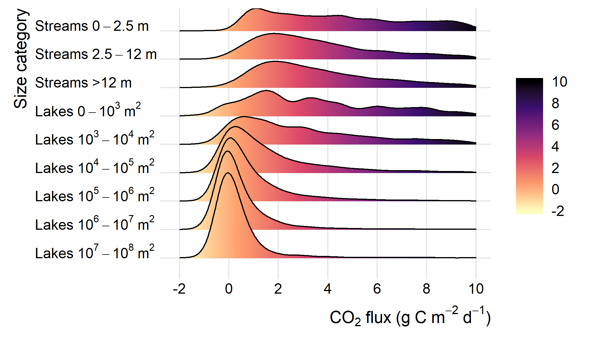

### Why a national freshwater carbon budget?

No doubt that the global agenda is all about CO~2~ and its role in ongoing climate change. But while we keep track of carbon in many industrial sectors and transport, we know surprisingly little about natural sources of CO~2~. Accumulating evidence points toward large greenhouse gas (CO~2~, CH~4~, N~2~O) emissions from freshwaters. But, we do not know their magnitude. 

### Constructing a preliminary budget

Dissolved CO~2~ in water can be estimated from alkalinity, pH and water temperature and this data is available from the national monitoring program. The product of the concentration and the gas transfer velocity yields the flux. We have used empirical models to estimate the gas transfer velocity in both lakes and streams for different size categories. From the density distributions of CO~2~ flux we quantified the uncertainty using Monte-Carlo simulation.  

The results have been published as a danish popular science article in the magazine ['Vand & Jord'](http://www.vand-og-jord.dk/).

*Figure showing the CO~2~ flux density distribution for different stream and lake size categories. Notice how CO~2~ emissions are prevalent, especially from small streams and lakes.*

This project was funded by [COWIfonden](https://www.cowifonden.com/donations/recent-projects/donations-2018).
